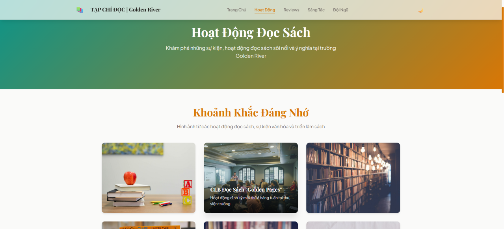
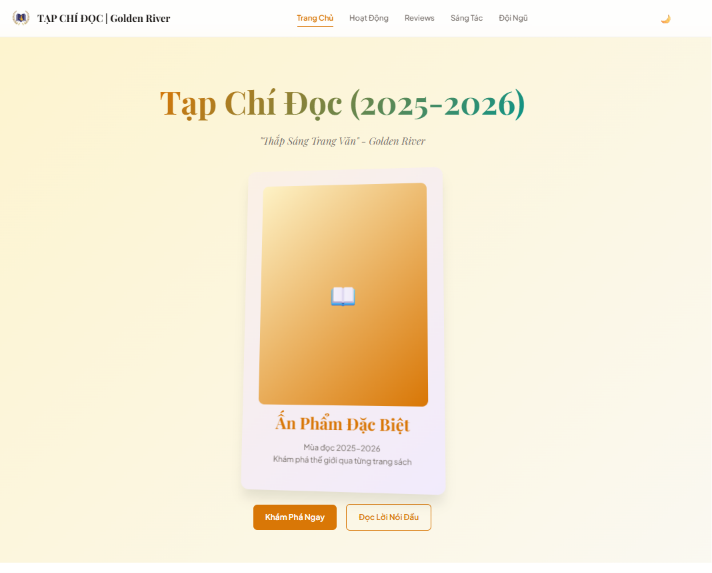

# 🌊 Golden River Reading Culture (2025-2026)


**"Illuminating the Written Page"** - An interactive digital magazine from Golden River, spreading reading culture and nurturing a love for literature within the Vinser community.

## 📱 Preview




## ✨ Features

- 📖 **PDF Flip Book** - Interactive magazine reading experience with natural page-flip effects
- 🎨 **Modern UI/UX** - Elegant, modern interface with gold and teal color scheme
- 🌓 **Dark/Light Mode** - Toggle between dark and light interface themes
- 📱 **Fully Responsive** - Optimized for all devices: desktop, tablet, and mobile
- ⚡ **Performance Optimized** - Windowed page loading to conserve memory
- 🎯 **Smooth Animations** - Fluid transitions and premium user experience
- ♿ **Accessible** - Keyboard navigation support and semantic HTML

## 🛠️ Technologies Used

- **HTML5** - Semantic markup and structure
- **CSS3** - Modern styling with CSS variables, flexbox, and grid
- **JavaScript (Vanilla)** - Interactive features and DOM manipulation
- **PDF.js 3.11.174** - PDF page rendering
- **StPageFlip 2.0.7** - Flip book page-turn effects
- **Responsive Design** - Mobile-first approach

## 📁 Project Structure

```
golden-river-reading-culture/
├── index.html              # Homepage - Introduction and main content
├── view.html               # Magazine Reader - PDF Flip Book
├── credits.html            # Team Page - Editorial board and credits
├── css/
│   ├── main.css            # Global styles, CSS variables, typography
│   ├── navbar.css          # Navigation bar and mobile menu
│   └── components.css      # Components: hero, gallery, team grid, footer
├── js/
│   └── main.js             # Scripts: theme toggle, mobile menu, animations
├── assets/
│   ├── preview.png         # Homepage preview image
│   ├── preview2.png        # Team page preview image
│   └── test.pdf            # Original magazine PDF file
├── test/                   # Test files (not used in production)
│   ├── test.html
│   ├── test2.html
│   └── test3.html
├── README.md               # Project documentation
├── NOTE.md                 # Internal notes
└── todo.md                 # Todo list (legacy)
```

## 🚀 Getting Started

### Prerequisites

- A modern web browser (Chrome, Firefox, Safari, Edge)
- No build process or dependencies required!

### Installation

1. Clone the repository:
   ```bash
   git clone https://github.com/Henrycoding-design/golden-river-reading-culture.git
   ```

2. Navigate to the project directory:
   ```bash
   cd golden-river-reading-culture
   ```

3. Open `index.html` in your web browser:
   ```bash
   # Windows
   start index.html
   
   # macOS
   open index.html
   
   # Linux
   xdg-open index.html
   ```

## 📖 Usage

### Homepage (index.html)
- View magazine introduction and the theme "Illuminating the Written Page"
- Explore the latest activities and updates
- Read the editorial letter from the editorial board
- Quick access to the PDF magazine

### Magazine Reader (view.html)
- Open the magazine in interactive flip book format
- Flip pages with smooth 3D effects
- Navigate using mouse or arrow keys
- Automatically switches between 1-page and 2-page layout based on screen size

### Team Page (credits.html)
- View editorial board information
- Special thanks to supporting organizations
- Detailed publication information

## 🎨 Design System

### Color Palette
- **Gold** (`#D97706`) - Primary color, representing warmth and knowledge
- **Teal** (`#0D9488`) - Secondary color, creating balance and modernity
- **Purple** (`#7C3AED`) - Accent color, adding depth to the design

### Typography
- **Serif**: Playfair Display - For headings, creating an elegant feel
- **Sans-serif**: Plus Jakarta Sans - For body text, ensuring readability

### Components
- **Hero Section** - Homepage with gradient and magazine cover card
- **Gallery Grid** - Responsive grid for updates and activities
- **Team Grid** - Display team members with avatars and information
- **Quote Callout** - Specially styled blockquote
- **Page Hero** - Header for sub-pages with gradient background

## 🔧 Technical Details

### PDF Flip Book Implementation
- **Windowed Loading**: Only renders ±10 pages around the current page
- **Memory Efficient**: Automatically unloads distant pages to save RAM
- **Mobile Optimized**: Automatically switches between 1-page and 2-page view
- **Keyboard Navigation**: Supports left/right arrow keys for page flipping

### Performance Features
- Lazy loading for PDF pages
- WebP format for images
- Optimized CSS transitions and animations
- Minimal JavaScript footprint

## 🤝 Contributing

Contributions are welcome! Here's how you can help:

1. Fork the repository
2. Create a feature branch (`git checkout -b feature/AmazingFeature`)
3. Commit your changes (`git commit -m 'Add some AmazingFeature'`)
4. Push to the branch (`git push origin feature/AmazingFeature`)
5. Open a Pull Request

## 📝 License

**All Rights Reserved**

This project and its contents are protected by copyright. All rights reserved.

---

**Golden River Reading Culture** - Illuminating the Written Page 📖🌊

*Made with ❤️ by Editorial Team - 2025-2026*